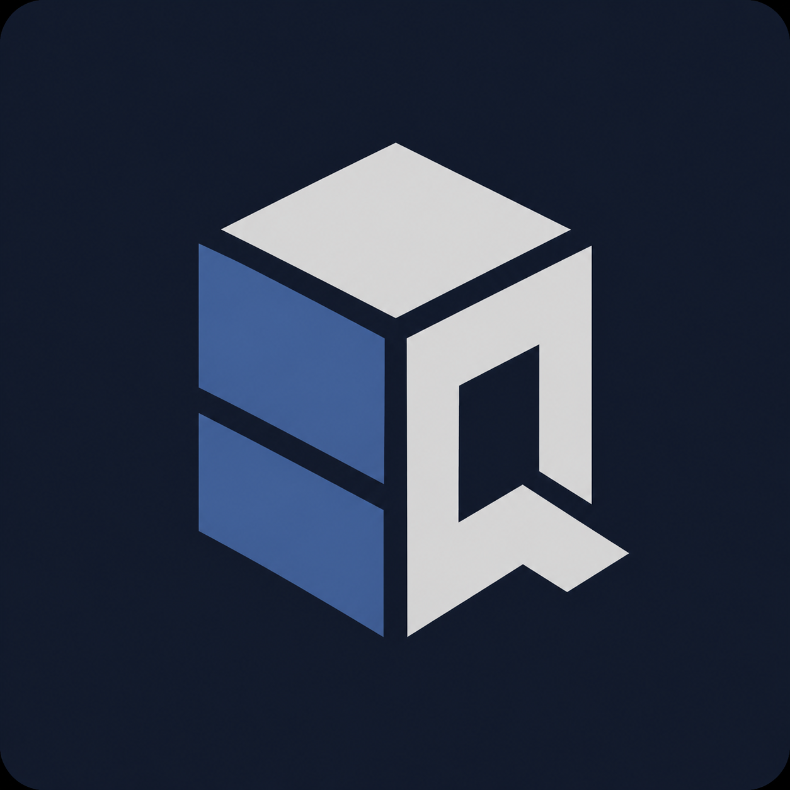
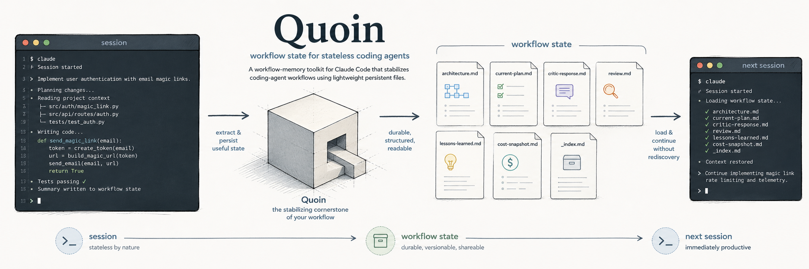

<p align="center">
  
</p>

# Quoin

**Workflow state for stateless coding agents.**

Quoin is a workflow-memory toolkit for coding agents. Its core value is the
artifact-centric workflow: plans, architecture notes, review artifacts, gates,
session handoff, lessons learned, and a cost ledger stored in predictable files
under `.workflow_artifacts/`.

Quoin now has two runtime paths:

- **Claude Code:** an installable global adapter that deploys skills, scripts,
  hooks, memory files, and workflow rules to `~/.claude`.
- **Codex:** a repo-local scaffold that generates `AGENTS.md` and points Codex
  at portable workflow contracts. It uses native Codex planning, approvals,
  sandboxing, repo-scoped instructions, and model/reasoning controls.

Quoin does not install global Codex commands, plugins, hooks, command files, or
runtime extensions.

## Why Quoin?

- **Persistent workflow state:** sessions share structured artifacts instead of
  restarting from memory alone.
- **Planning rigor:** architecture, planning, review, and gate phases have
  explicit artifact contracts.
- **Runtime portability:** shared workflow semantics live in `quoin/core/`,
  while Claude and Codex behavior is isolated in adapter directories.
- **Session continuity:** both runtime paths preserve handoff state under
  `.workflow_artifacts/memory/sessions/`.
- **Cost discipline:** Claude has live cost tooling; Codex writes portable cost
  rows with unavailable telemetry marked honestly as `not_available`.

## Install

Install the package:

```bash
pip install quoin
```

Install or update the Claude Code adapter:

```bash
quoin install --runtime claude
quoin doctor --runtime claude
```

`quoin install` and bare `quoin` remain backward-compatible aliases for the
Claude install path. They deploy to `~/.claude`.

Generate the Codex repo-local scaffold:

```bash
quoin install --runtime codex --project-root .
quoin install --runtime codex --project-root . --check
quoin doctor --runtime codex --project-root . --smoke
```

The Codex install path writes `AGENTS.md` in the selected project root. The
`--check` form verifies that `AGENTS.md` is up to date without writing files.
The doctor command verifies repo-local readiness; `--smoke` also runs the
deterministic Codex workflow smoke test.

Equivalent Codex setup command:

```bash
quoin codex init --project-root .
quoin codex init --project-root . --check
```

Legacy source install for Claude remains supported:

```bash
git clone https://github.com/FourthWiz/quoin
cd quoin
bash quoin/install.sh
```

GitHub redirects the old `FourthWiz/claude_dev_workflow` URL to this repository.

## Runtime Support

| Runtime | Setup command | Scope | Implemented behavior |
|---------|---------------|-------|----------------------|
| Claude Code | `quoin install --runtime claude` | Global adapter under `~/.claude` | Skills, scripts, hooks, memory files, `CLAUDE.md` workflow rules, slash-command workflow |
| Codex | `quoin install --runtime codex --project-root .` | Repo-local `AGENTS.md` | Portable artifact workflow, generated root instructions, readiness/smoke checks, handoff validation, cost event writer |

The portable core is shared. Runtime-specific mechanics are adapter-owned:

- Claude adapter files live under `quoin/adapters/claude/` and install to
  `~/.claude`.
- Codex adapter files live under `quoin/adapters/codex/` and are used from the
  repository. They are documentation, generated instructions, and validation
  scripts, not Codex command packages.

## Codex Quickstart

In the project where you want Codex to use Quoin:

```bash
pip install quoin
quoin install --runtime codex --project-root .
quoin doctor --runtime codex --project-root . --smoke
```

Then ask Codex for Quoin phases in natural language:

- "Use Quoin to discover this repository and write the discovery artifacts."
- "Use Quoin to create an architecture artifact for this task."
- "Use Quoin to write a current plan under `.workflow_artifacts/`."
- "Use Quoin to implement the current plan."
- "Use Quoin to review this implementation against the current plan."
- "Use Quoin to run a gate before the next phase."
- "Update Quoin session handoff and lessons learned."
- "Record a Codex cost event for this task."

The practical Codex workflow loop is documented as:

```text
discover -> plan -> implement -> review -> gate
```

Codex procedure docs live in `quoin/adapters/codex/procedures/` and link back
to portable contracts in `quoin/core/skills/`.

## Codex Validation And Utilities

Codex readiness and smoke:

```bash
quoin doctor --runtime codex --project-root .
quoin doctor --runtime codex --project-root . --smoke
```

Handoff validation:

```bash
python3 quoin/adapters/codex/validate_codex_handoff.py --self-test
python3 quoin/adapters/codex/validate_codex_handoff.py --project-root . --file .workflow_artifacts/memory/sessions/<date>-<task>-codex.md
```

Cost event writing and validation:

```bash
python3 quoin/adapters/codex/cost_event.py --self-test
python3 quoin/adapters/codex/cost_event.py write --project-root . --task <task> --phase <phase> --effort <low|medium|high|max|unknown>
python3 quoin/adapters/codex/cost_event.py validate --project-root . --task <task> --expect-codex
```

Codex cost rows use the portable cost-ledger shape. They record known local
values such as runtime, task, phase, timestamp, session id when supplied, and
effort. Token counts, dollar cost, and telemetry source are recorded as
`not_available` because this repository has no verified Codex local telemetry
interface.

## Claude Quickstart

After installing the Claude adapter:

```text
/init_workflow   one-time project bootstrap
/architect       design the solution
/thorough_plan   converge on a plan with critic review
/implement       write code from the plan
/review          verify implementation against the plan
/gate            stop for an explicit quality checkpoint
/end_of_task     finalize, push, and capture lessons
```

Claude-specific command behavior, model assignments, hook behavior, and
cost-capture plumbing are documented in `quoin/CLAUDE.md`.

## Claude Skills

These slash commands are Claude adapter commands. Codex uses the same portable
workflow intent through natural-language phase requests and repo-local docs.

### Planning And Architecture

| Command | Model | What it does |
|---------|-------|-------------|
| `/architect` | Opus | Deep architectural analysis; internal critic loop |
| `/plan` | Opus | Detailed implementation plan |
| `/thorough_plan` | Opus | Triages task size; runs plan -> critic -> revise convergence |
| `/critic` | Opus | Reviews a plan for gaps, risks, and integration issues |
| `/revise` | Opus | Revises plan from critic feedback in strict/large mode |
| `/revise-fast` | Sonnet | Revises plan from critic feedback in medium mode |

### Implementation And Review

| Command | Model | What it does |
|---------|-------|-------------|
| `/implement` | Sonnet | Writes code from the plan |
| `/review` | Opus | Verifies implementation against the plan |
| `/gate` | Sonnet | Automated quality checkpoint between phases; requires approval |
| `/rollback` | Sonnet | Safely undoes an implementation phase or specific tasks |

### Session Lifecycle

| Command | Model | What it does |
|---------|-------|-------------|
| `/init_workflow` | Opus | One-time project bootstrap; creates `.workflow_artifacts/` and runs discovery |
| `/discover` | Opus | Scans repos; maps architecture, dependencies, and git history |
| `/start_of_day` | Haiku | Morning briefing from daily/session memory |
| `/end_of_day` | Haiku | Saves session state and promotes insights |
| `/end_of_task` | Sonnet | Pushes branch, captures lessons, and finalizes task state |

### Utilities

| Command | Model | What it does |
|---------|-------|-------------|
| `/run` | Opus | End-to-end pipeline orchestrator; pauses at gates |
| `/cost_snapshot` | Haiku | Live Claude cost: today, lifetime, and per-task breakdown |
| `/triage` | Haiku | Routes the request to the right workflow phase |
| `/weekly_review` | Haiku | Aggregates weekly progress into a structured review |
| `/capture_insight` | Haiku | Logs a pattern or discovery to daily insights |
| `/expand <path>` | Sonnet | Re-renders a terse workflow artifact in readable English |

## Architecture



Quoin separates portable workflow contracts from runtime adapters:

- `quoin/core/workflow/` defines shared rules, task layout, session state, cost
  ledger shape, and skill metadata.
- `quoin/core/skills/` defines runtime-neutral skill intent.
- `quoin/core/scripts/` contains portable helper implementations.
- `quoin/adapters/claude/` contains Claude-specific skill bodies and runtime
  assumptions.
- `quoin/adapters/codex/` contains Codex-facing repo-local instructions,
  procedures, readiness checks, handoff validation, and cost-event tooling.

The project root containing `AGENTS.md` is the Quoin project root for Codex.
Codex writes `.workflow_artifacts/` there even when the code being edited lives
in a nested subdirectory.

## Cost And Effort

Claude and Codex expose different runtime mechanics, so Quoin keeps cost and
effort handling honest:

- Claude skills declare Haiku/Sonnet/Opus model tiers and can self-dispatch
  through Claude's Agent/Skill behavior.
- Claude cost tooling can read Claude session logs and `ccusage` output.
- Codex adapter docs use runtime-neutral effort labels:
  `low`, `medium`, `high`, `max`, and `unknown`.
- Codex cost rows do not infer token counts or dollars from another runtime.
  Unavailable telemetry is recorded as `not_available`.

For runtime-neutral effort vocabulary, see
[`quoin/docs/effort-levels.md`](quoin/docs/effort-levels.md).

## Documentation

- [`quoin/QUICKSTART.md`](quoin/QUICKSTART.md) - Claude command reference table
- [`quoin/CLAUDE.md`](quoin/CLAUDE.md) - Claude workflow rules, model assignments, artifacts, and cost conventions
- [`quoin/adapters/codex/setup.md`](quoin/adapters/codex/setup.md) - Codex repo-local setup and readiness
- [`quoin/adapters/codex/workflow.md`](quoin/adapters/codex/workflow.md) - Codex workflow execution guide
- [`quoin/adapters/codex/handoff.md`](quoin/adapters/codex/handoff.md) - Codex session handoff contract
- [`quoin/adapters/codex/cost.md`](quoin/adapters/codex/cost.md) - Codex cost event behavior
- [`quoin/docs/runtime-portability.md`](quoin/docs/runtime-portability.md) - portable core and runtime adapter boundary
- [`quoin/docs/runtime-portability-status.md`](quoin/docs/runtime-portability-status.md) - current migration status by runtime
- [`quoin/docs/runtime-parity-matrix.md`](quoin/docs/runtime-parity-matrix.md) - evidence-based runtime parity matrix
- [`quoin/docs/effort-levels.md`](quoin/docs/effort-levels.md) - runtime-neutral effort vocabulary

## Boundaries

Quoin intentionally does not:

- install global Codex commands or plugins
- guess Codex local runtime paths
- duplicate Codex approvals or sandboxing
- claim live Codex hooks
- translate Claude slash commands into Codex command files
- infer Codex token or dollar telemetry from Claude tooling

Future runtime integrations should add explicit adapter contracts instead of
copying Claude-specific behavior into the portable core.

## Contributing

Bug reports and PRs welcome. Quoin development uses Quoin itself: keep changes
artifact-aware, runtime boundaries explicit, and documentation honest about what
is implemented versus planned.

## License

MIT
